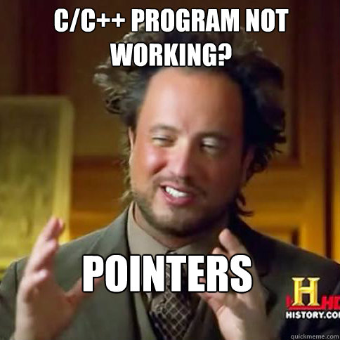

% Rust
% Clément Delafargue & Geoffroy Couprie
% 17 Avril 2014

<section class="slide cover title">
  <div>
  <div class="color1"></div><div class="color2"></div><div class="color3"></div>
  <h1>Programmation système</h1>
  
  <p class="footer">
  <a class="hashtag" href="https://twitter.com/search?q=%23devoxxrust">#devoxxrust</a>
  <span class="twitter"><a href="https://twitter.com/clementd" rel="me" class="twitter">@clementd</a></span> /
  <span class="twitter"><a href="https://twitter.com/gcouprie" rel="me" class="twitter">@gcouprie</a></span></p>
  </div>
</section>

<section class="slide">
<div>
## le CPU, zone de non-droit


* exécution directe sur CPU
* manipulation directe de la mémoire
* intégration avec d'autres applications


<!--Loin du monde merveilleux des VM avec GC et compilation JIT-->
</div>
</section>

<section class="slide">
<div>
## Pourquoi un langage bas-niveau ?

<!-- Il y a des use cases qu’un langage à VM ne peut pas remplir:-->
* driver kernel
* bibliothèque importable dans d’autres langages
* multicore
* indépendance du GC et de ses pauses
* embarquer dans un langage à GC
</div>
</section>

<section class="slide">
<div>
## Les langages Old School



* C
* C++
* Fortran

</div>
</section>

<section class="slide">
<div>
## Aucune assurance


* Pas de vérification du format des données
* gestion d’erreurs ardue
* null pointer dereference
* buffer overflows
* heap overflows
* double free
* etc.

</div>
</section>

<section class="slide">
<div>

## Y a pas de bug dans mon code
```text
Program received signal SIGSEGV, Segmentation fault.
0x1c0007a8 in main () at main.c:6
```
</div>
</section>

<section class="slide cover title">
  <div>
  <div class="color1"></div><div class="color2"></div><div class="color3"></div>
  <h1>Rust</h1>
  
  <p class="footer">
  <a class="hashtag" href="https://twitter.com/search?q=%23devoxxrust">#devoxxrust</a>
  <span class="twitter"><a href="https://twitter.com/clementd" rel="me" class="twitter">@clementd</a></span> /
  <span class="twitter"><a href="https://twitter.com/gcouprie" rel="me" class="twitter">@gcouprie</a></span></p>
  </div>
</section>

<section class="slide">
<div>
## Buts du langage


* bas niveau
* portable
* memory safe
* concurrence
* parallélisme

</div>
</section>

<section class="slide">
<div>
## Memory safe

* gérer la mémoire à la place du développeur
* supprimer des classes de bugs entières dans le compilateur

```text
    Do not kill bugs, kill bug classes
```

<!--Même les meilleurs développeurs font des erreurs, et un certain nombre d’entre elles peuvent être repérées grâce à un compilateur intelligent et un langage qui donne suffisamment d’informations au compilateur.-->

</div>
</section>

<section class="slide">
<div>
## Un monde sans GC ?

3 méthodes de stockage de données:

* statique (dure aussi longtemps que le process)
* stack (dure aussi longtemps que le bloc courant)
* heap (zone mémoire allouée et relâchée à la demande)

</div>
</section>

<section class="slide">
<div>

## Statique

```rust
fn main() {
  println!("hello world");
}
```

</div>
</section>

<section class="slide">
<div>
## Stack

```rust
fn f() -> &uint {
  let s = 1;
  let r = &s;
  r
}
fn main() {
  println!("{}", f());
}
```

```text
static.rs:3:11: 3:13 error: `s` does not live long enough
static.rs:3   let r = &s;
```

</div>
</section>

<section class="slide">
<div>
## Stack: l'erreur complète

```text
static.rs:3:11: 3:13 error: `s` does not live long enough
static.rs:3   let r = &s;
                      ^~
static.rs:1:17: 5:2 note: reference must be valid for the
anonymous lifetime #1 defined on the block at 1:16...
static.rs:1 fn f() -> &uint {
static.rs:2   let s = 1;
static.rs:3   let r = &s;
static.rs:4   r
static.rs:5 }
static.rs:1:17: 5:2 note: ...but borrowed value is only
valid for the block at 1:16
static.rs:1 fn f() -> &uint {
static.rs:2   let s = 1;
static.rs:3   let r = &s;
static.rs:4   r
static.rs:5 }
error: aborting due to previous error
```

</div>
</section>

<section class="slide">
<div>
## Heap

```rust
fn f() -> ~str {
  let s = ~"hello world";
  s
}
fn main() {
  println!("{}", f());
}
```

</div>
</section>

<section class="slide">
<div>

## Ownership

```rust
fn main() {
  let s = ~"hello world";
  spawn(proc() {
    println!("other task: {}", s);
  });
  println!("main task {}", s);
}
```
```text
borrow.rs:6:28: 6:29 error: use of moved value: `s`
borrow.rs:6   println!("main task {}", s);
                                       ^
[...]
borrow.rs:3:9: 5:4 note: `s` moved into closure environment
here because it has type `proc:Send()`,which is non-copyable
(perhaps you meant to use clone()?)
borrow.rs:3   spawn(proc() {
borrow.rs:4     println!("other task: {}", s);
borrow.rs:5   });
```

<!--En C:
une zone statique est modifiable, on peut pointer sur un morceau de stack après être sorti du bloc, on peut oublier de désallouer une zone mémoire (fuite), on peut désallouer une zone mémoire plusieurs fois (double free)
-->
</div>
</section>

<section class="slide">
<div>
## Ca peut être unsafe

```rust
use std::cast;
let mut x: u8 = 1;

let ref_1: &mut u8 = &mut x;
let ref_2: &mut u8 = unsafe {
  cast::transmute_mut_region(ref_1)
};

// ref_1 et ref_2 pointent vers la même zone mémoire
*ref_1 = 10;
*ref_2 = 20;
```
</div>
</section>

<section class="slide">
<div>
## On peut écrire de l'assembleur

```rust
fn add(a: int, b: int) -> int {
  let mut c = 0;
  unsafe {
    asm!("add $2, $0"
         : "=r"(c)
         : "0"(a), "r"(b)
         );
  }
  c
}
```
</div>
</section>

<section class="slide">
<div>

## GC


Ca existe, mais...

</div>
</section>

<section class="slide">
<div>
## Que propose Rust?

* données immutables par défaut, mutables à la demande
* gestion du scope d’une variable (ajout automatique de malloc/free)
* gestion de l’ownership (on ne peut modifier une zone mémoire gérée par un autre thread)
* les manipulations non vérifiables sont isolées
</div>
</section>

<section class="slide">
<div>

## Concurrence
Rust implémente le modèle CSP. Plusieurs tasks (green threads) s’exécutant sur un pool de threads (mode M:N), ou une task par thread (mode 1:1). Ces tasks communiquent par des channels à sens unique ou double sens, asynchrones (un mode synchrone est dispo, il me semble).
Une task peut embarquer des données du contexte de la task qui l’a lancée (elle en prend l’ownership). Les channels sont typés, donc les données qui y circulent sont garanties de ce type, dès la compilation.

</div>
</section>


<section class="slide cover title">
  <div>
  <div class="color1"></div><div class="color2"></div><div class="color3"></div>
  <h1>Type-Directed Development</h1>
  <div style="text-align: center; width: 100%">
  
  </div>
  <p class="footer">
  <a class="hashtag" href="https://twitter.com/search?q=%23devoxxrust">#devoxxrust</a>
  <span class="twitter"><a href="https://twitter.com/clementd" rel="me" class="twitter">@clementd</a></span> /
  <span class="twitter"><a href="https://twitter.com/gcouprie" rel="me" class="twitter">@gcouprie</a></span></p>
  </div>
</section>


<section class="slide">
<div>

## L’immutabilité

 - Structure de données persistentes
 - Raisonnement simplifié
 - *Thread safety*
 - Optimisations possibles

</div>
</section>

<section class="slide">
<div>

## Système de types

 - Typage statique
 - Typage fort (whatever it means)
 - Garanties statiques sur l'exécution
 - Polymorphisme paramétrique (*génériques*)
 - Type system **expressif**

</div>
</section>

<section class="slide">
<div>

## Aller plus loin


 - Durée de vie des variables
 - Structures de contrôle typées
 - Propagation de la mutabilité

</div>
</section>

<section class="slide">
<div>

## Structures de données

- Structs (product type)

```rust

pub struct Point {
    pub x: int,
    pub y: int
}

pub struct Circle {
    pub center: ~Point,
    pub radius: uint
}
```

</div>
</section>

<section class="slide">
<div>

## Structures de données

- Enums (sum type)

```rust

pub enum Json {
    Number(f64),
    String(~str),
    Boolean(bool),
    List(List),
    Object(~Object),
    Null,
}

pub type List = ~[Json];
pub type Object = TreeMap<~str, Json>;

```

</div>
</section>

<section class="slide">
<div>

## Pattern matching

- Énumération
- Déconstruction

```rust

match jsonValue {
    Number(n) => ...
    String(s) => ...
    ...
}

```

</div>
</section>


<section class="slide">
<div>

## Traits

- Séparation données / fonctions

```rust
impl Circle {
    pub fn radius(&self) -> float {
        float::consts::pi * self.radius * 2
    }
}
```

</div>
</section>

<section class="slide">
<div>

## Typeclass pattern

- Factorisation des comportements

```rust

pub trait Show {
    fn fmt(&self, &mut Formatter) -> Result;
}
impl fmt::Show for Circle {
    fn show(&self, fmt: &mut ftm::Formatter) -> float {
        write!(fmt.buf, ...)
    }
}
```

</div>
</section>

<section class="slide">
<div>

## Traits de base

- `Eq` pour l'égalité (auto-implémentable)
- `Ord` pour la comparaison
- `Hash` pour les condensats (auto-implémentable)
- … et beaucoup d'autres !

</div>
</section>

<section class="slide">
<div>

## Polymorphisme paramétrique

```rust
pub enum Option<T> {
    None,
    Some(T)
}
```

</div>
</section>

<section class="slide">
<div>

## Polymorphisme paramétrique + traits


 - Types génériques
 - \+ contraintes spécifiques

</div>
</section>

<section class="slide">
<div>

## Typeclass pattern

```rust
impl<A:ToJson> ToJson for Option<A> {
    fn to_json(&self) -> Json {
        match *self {
          None => Null,
          Some(ref value) => value.to_json()
        }
    }
}
```

</div>
</section>


<section class="slide">
<div>

## Crates, modules, etc

 - *Crate* <=> bibliothèques
 - Imports explicites
 - Pas de fuites

</div>
</section>

